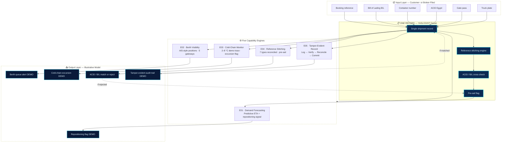

<div align="center">

<!-- ═══════════════════════════════════════════════════════════════════════ -->
<!-- YASLOGIST OCEAN — CINEMATIC ANIMATED HERO                              -->
<!-- 1920 × 720 · CSS keyframe loop · 11s seamless · GitHub-compatible SVG  -->
<!-- ═══════════════════════════════════════════════════════════════════════ -->



</div>

---

# YASLOGIST Ocean

> **Every container. One record, quay to gate.**

**YASLOGIST Ocean** is the sea-freight surface of the YASLOGIST platform — an interactive demo that reads a single shipment record across five Egyptian gateway scenarios and shows how five capability engines can illuminate the bottlenecks that cost ocean freight the most.

A shipment carries many identities on its way through a port: a booking reference, a bill of lading, a container number, an ACID, a gate pass, a truck plate. YASLOGIST reads those references onto **one record** and keeps it intact across the handover from sea to road. This repository is the front end for the ocean view of that record.

[](https://www.typescriptlang.org/)
[](https://vitejs.dev/)
[](https://ocean.yaslogist.me/)
[](https://yaslogist.me)

<div align="center">

**YASLOGIST** · Ocean surface · Egypt · Saudi Arabia · Red Sea &amp; Gulf corridor design
&nbsp;&nbsp;|&nbsp;&nbsp;Built from scratch by **Ahmed Yasser Ali** · Supply Chain &amp; Logistics · New Cairo, Cairo, Egypt

</div>

---

## 01 — What this is — and what it is not

YASLOGIST **observes and unifies shipment data. It does not move cargo, and it does not file declarations.**

- Not a freight forwarder, a shipping agent, or a customs broker.
- No fleet, no vessels, no warehouses, no customs filing on anyone's behalf.
- Customs milestones reach YASLOGIST through the customer or their licensed broker — never by direct authority access.

The boundary is a design constraint, not a disclaimer. Every claim on the site is written to stay inside it.

> All vessel telemetry, port figures and simulator outputs shown in this demo are **illustrative model outputs**, marked inline with a model badge rather than presented as a live operational feed. You will not find shipment counts, container volumes, customer counts, or uptime figures here — because they would not be true yet.

---

## 02 — The five engines

The page frames five recurring, costly bottlenecks in Egyptian ocean freight, and pairs each with the capability that reads it — one to one:

| # | Bottleneck | Engine | What the record reads |
|---|-----------|--------|----------------------|
| 01 | Empty repositioning cost | **Predictive ETA & repositioning signal** | Demand, weather, port load and fuel → one repositioning flag |
| 02 | Berth queue & demurrage | **Vessel AIS & berth visibility** | Sample AIS-style positions and berth states across five Egyptian gateways |
| 03 | Pharma cold-chain breaks | **Cold-chain monitoring (2–8 °C)** | A simulated temperature trace, surfaced at container level before handoff |
| 04 | ACID & B/L rejections | **ACID & B/L reference stitching** | Booking, B/L, container, ACID, gate pass, plate — seven reference types reconciled onto one record |
| 05 | Document & release fraud | **Tamper-evident shared record** | Documents and handovers move through four visible stages: log → verify → reconcile → commit |

| Corridor | Coverage |
|----------|----------|
| **Egypt gateways** | Alexandria · Dekheila · Sokhna · Damietta · East Port Said — five scenarios in this demo |
| **Reference types** | Booking → B/L → Container → ACID → Gate Pass → Truck Plate — seven stitched onto one record |
| **YASLOGIST modes** | Ocean · Land · Air — this repo is the Ocean surface |
| **Strategic markets** | Egypt (initial) · Saudi Arabia · Red Sea · Gulf · wider global trade lanes |

---

## 03 — Engineering architecture

```
┌─────────────────────────────────────────────────────────────────────┐
│                        YASLOGIST OCEAN                               │
│  React 19 + TypeScript + Vite + Tailwind CSS v4                     │
│  Bilingual EN / AR · RTL · 5 languages · Dark / Light theme         │
├─────────────────────────────────────────────────────────────────────┤
│                                                                     │
│  ┌──────────────────────────────────────────────────────────────┐   │
│  │  HERO  │  Vessel telemetry console · scroll-cue · badges    │   │
│  │        │  Founder signature card · parallax background        │   │
│  └────────┴─────────────────────────────────────────────────────┘   │
│                                                                     │
│  ┌──────────────────────────────────────────────────────────────┐   │
│  │  STATS  │  Four identity rows: gateways · references         │   │
│  │         │  engines · transport modes                         │   │
│  └────────┴─────────────────────────────────────────────────────┘   │
│                                                                     │
│  ┌──────────────────────────────────────────────────────────────┐   │
│  │  SOLUTIONS  │  5 capability cards · 5 bottleneck pairings   │   │
│  │             │  accent-per-card · demo badge · metric deck    │   │
│  └─────────────┴───────────────────────────────────────────────┘   │
│                                                                     │
│  ┌──────────────────────────────────────────────────────────────┐   │
│  │  SIMULATOR  │  TEU × NM scenario engine · carbon/time/cost  │   │
│  │             │  illustrative coefficients · no live benchmark│   │
│  └─────────────┴───────────────────────────────────────────────┘   │
│                                                                     │
│  ┌──────────────────────────────────────────────────────────────┐   │
│  │  PILLARS  │  5 engine deep-dives · Mermaid inference charts  │   │
│  │           │  neural forecast · fleet radar · cold chain      │   │
│  └───────────┴──────────────────────────────────────────────────┘   │
│                                                                     │
│  ┌──────────────────────────────────────────────────────────────┐   │
│  │  HANDOFF  │  Cross-modal journey: sea → road · 5 chapters   │   │
│  └───────────┴──────────────────────────────────────────────────┘   │
│                                                                     │
│  ┌──────────────────────────────────────────────────────────────┐   │
│  │  CLOSING  │  Founder-led enquiry channel · WhatsApp · phone  │   │
│  └───────────┴──────────────────────────────────────────────────┘   │
│                                                                     │
├─────────────────────────────────────────────────────────────────────┤
│  BACKGROUND  │  JPEG frame sequence · canvas blit · scroll-scrub   │
│  (no <video>)│  60 landscape + 30 portrait frames · LERP blend   │
├─────────────────────────────────────────────────────────────────────┤
│  THEME       │  [data-theme] dark / light · pre-paint head script  │
│  TOKENS      │  Every colour a token · identical set in both themes│
├─────────────────────────────────────────────────────────────────────┤
│  DEPLOY      │  npm run build → single HTML app shell + public/   │
│              │  media in dist/ · Vercel · Git-connected on main   │
└─────────────────────────────────────────────────────────────────────┘
```

### Runtime stack

| Layer | Technology | Notes |
|-------|-----------|-------|
| Framework | **React 19** + **TypeScript 5.9** | Strict-mode safe; no legacy React patterns |
| Build | **Vite 7** + `@vitejs/plugin-react` | Repository-local single-file build plugin (JS/CSS inline into one HTML app shell) |
| Styles | **Tailwind CSS v4** (`@tailwindcss/vite`) | Token-driven; both themes define an identical token set |
| Class merge | `clsx` + `tailwind-merge` | Predictable class composition |
| Analytics | `@vercel/analytics` + `@vercel/speed-insights` | Aggregate traffic and performance only; no ads, no account |
| Fonts | Archivo · IBM Plex Sans · IBM Plex Mono · Aref Ruqaa · IBM Plex Sans Arabic | Google Fonts · `display=swap` |

### Threading & performance model

- **Background**: pre-decoded JPEG frame sequence blitted to canvas. Scroll position drives a LERPed frame index; adjacent frames are alpha-blended by the fractional index. No `<video>` element — no decoder seeks on scroll.
- **Panels**: pointer-driven parallax on fine-pointer devices only; CSS custom properties written from rAF-throttled handler; React never re-renders while the pointer moves.
- **Animations**: SVG `<animateMotion>` timelines paused when a panel is off-screen, on touch devices, or under `prefers-reduced-motion`.
- **Content visibility**: `content-visibility: auto` on sections; hash anchors materialise preceding placeholders before scrolling.

---

## 04 — System blueprint (Mermaid)



> Mermaid renders natively in GitHub Markdown. All nodes describe verified system behaviour. No services, databases or infrastructure are invented.

---

## 05 — Execution intelligence

### Scroll-scrubbed background (why no `<video>`)

Driving `video.currentTime` from scroll forces the media decoder to seek on every tick. Safari serialises those seeks against the compositor, which produces scrub stutter. Instead:

- Footage is **pre-decoded to a JPEG frame sequence** (60 landscape + 30 portrait frames per theme) and blitted to a canvas.
- A scroll frame costs **one image draw** and never touches a decoder.
- The canvas backing store is **exactly the frame size** — every draw is a 1:1 blit; CSS `object-fit: cover` handles the viewport fit on the GPU.
- Frame index is a pure function of the engine's LERPed `scrub` value, so frames advance only while scrolling and stop dead when scrolling stops.
- Adjacent frames are **alpha-blended by the fractional index** — a 2-frame blend reads smoother than a hard frame switch at twice the count.

### Scroll engine

- One shared rAF loop. Panels subscribe to a single `subscribeScroll` callback.
- `content-visibility: auto` sections resolve and release height as they near the viewport; scrollHeight drifts, so progress is derived from **LERPed scroll pixels**, not document percent.
- Camera pan/zoom is the only vestibular trigger and is gated on `prefers-reduced-motion`.
- Scrubbing tracks the user's own scroll 1:1, so it is direct manipulation and stays enabled under reduced-motion.

### Pointer interaction

- Continuous pointer work is suspended on coarse (touch) devices — the exact static composition is preserved.
- rAF-throttled; writes CSS custom properties `--pointer-x`, `--pointer-y`, `--tilt-x`, `--tilt-y` only.
- React never re-renders while the pointer moves.

---

## 06 — Quick start

```bash
git clone https://github.com/YASLOGIST/OCEAN-YASLOGIST.git
cd OCEAN-YASLOGIST
npm install
npm run dev        # Vite dev server · http://localhost:5173
```

```bash
npm run build      # Production build — single HTML app shell + public/ media → dist/
npm run preview    # Serve the production build locally
npm run typecheck  # tsc --noEmit — types, JSX and imports
npm run test       # Deterministic scroll-engine harness
npm run check:bundle  # Bundle-size gate
```

```bash
npm run gate       # Full gate: typecheck → test → build → bundle check
```

> Run `npm run gate` before every push. Ship only when it is clean.

---

## 07 — Design system

### Bilingual, never JS text-swapped

- English and Arabic switched by paired `lang` spans with CSS `visibility` — never JS text swapping.
- Full RTL via CSS logical properties throughout.
- Five languages supported: EN · AR · ZH · TR · FR.

### Theme tokens

- Light / dark via `[data-theme]` with a **pre-paint head script** so the correct theme paints before first paint.
- Every colour is a token. Both theme blocks define an **identical token set** with documented contrast ratios.

### Imagery discipline

- Identifiers are the imagery: no stock photography, no world map, no fabricated dashboards.
- One accent, used sparingly.
- All vessel telemetry and simulator outputs are **illustrative model outputs**, marked with an inline model badge.

### Five viewport verification

Every visual change is checked across **5 viewports (360 / 375 / 390 / 412 / 430) × 2 languages × 2 themes** for:

- Document overflow
- Element spill
- Sub-44px tap targets
- Caption collisions
- Text truncation

A change ships only at **zero issues**.

---

## 08 — Engineering status

| Area | Status | Notes |
|------|--------|-------|
| React 19 + TypeScript | ✅ Implemented | Strict-mode safe; `tsc --noEmit` clean |
| Vite build + single-file plugin | ✅ Implemented | JS/CSS inline into one HTML app shell |
| Tailwind CSS v4 | ✅ Implemented | `@tailwindcss/vite` · token-driven |
| Dark / light theme | ✅ Implemented | `[data-theme]` · pre-paint head script |
| Bilingual EN/AR + RTL | ✅ Implemented | CSS `lang` spans · logical properties |
| 5-language switcher | ✅ Implemented | EN · AR · ZH · TR · FR |
| Scroll-scrubbed background | ✅ Implemented | JPEG frame sequence · canvas blit · LERP blend |
| Hero vessel console | ✅ Implemented | Telemetry card · model badge · route pulse |
| 5 engine capability cards | ✅ Implemented | Accent-per-card · demo badge · metric deck |
| Scenario simulator | ✅ Implemented | TEU × NM · illustrative coefficients |
| 5 pillar deep-dives | ✅ Implemented | Mermaid charts · neural forecast · radar · cold chain |
| Cross-modal handoff | ✅ Implemented | Sea → road · 5 chapters |
| Founder closing channel | ✅ Implemented | WhatsApp · phone · founder-led |
| Vercel deployment | ✅ Implemented | Git-connected on `main` |
| Live customer operations | 🔬 Not applicable | This is a demo · no live customer operations |

---

## 09 — Repository map

```
OCEAN-YASLOGIST/
├── README.md                  ← this file
├── index.html                 ← HTML app shell (pre-paint theme script + fonts)
├── package.json               ← React 19 · Vite · Tailwind v4
├── tsconfig.json
├── vite.config.ts             ← repo-local single-file build plugin
├── vercel.json
├── .gitignore
├── brand-originals/           ← source YASLOGIST assets (founder photo, logo)
├── public/
│   ├── brand/
│   │   └── yaslogist-motion-mark.webp   ← brand mark used in live site
│   ├── frames/
│   │   ├── day-lite/          ← 60 JPEG frames · day theme · landscape
│   │   └── day-phone-lite/    ← 30 JPEG frames · day theme · portrait
│   ├── maps/
│   └── media/
├── src/
│   ├── main.tsx               ← React DOM render entry
│   ├── App.tsx                ← root · providers · scroll loop · pointer layer
│   ├── index.css              ← token layer · theme blocks · utilities
│   ├── assets/
│   │   ├── brand.ts           ← founder photo import
│   │   └── brand/             ← founder.jpg · README.txt
│   ├── components/
│   │   ├── Background.tsx     ← scroll-scrubbed frame-sequence canvas
│   │   ├── Hero.tsx           ← vessel console · badges · founder card
│   │   ├── Brand.tsx          ← YASLOGIST mark · founder avatar
│   │   ├── Solutions.tsx      ← 5 capability cards
│   │   ├── Simulator.tsx      ← TEU × NM scenario engine
│   │   ├── Pillars.tsx        ← 5 engine deep-dives
│   │   ├── CrossModalHandoff.tsx
│   │   ├── Closing.tsx        ← founder-led enquiry channel
│   │   ├── Footer.tsx
│   │   ├── Navbar.tsx         ← 5-language switcher · theme toggle
│   │   ├── Hud.tsx
│   │   ├── Stats.tsx
│   │   ├── FleetRadar.tsx
│   │   ├── NeuralForecast.tsx
│   │   ├── VoyageProfile.tsx
│   │   ├── FulfillmentBay.tsx
│   │   ├── BlockchainSection.tsx
│   │   ├── SuiteSwitcher.tsx
│   │   ├── LegalModal.tsx
│   │   ├── ui.tsx             ← GlassCard · ModelBadge · NeonButton · etc.
│   ├── hooks/
│   │   └── useInView.ts
│   ├── lib/
│   │   ├── i18n.tsx           ← 5-language dictionary · RTL · lang switcher
│   │   ├── scroll.ts          ← shared rAF scroll engine · LERP · reduced-motion
│   │   ├── theme.tsx          ← [data-theme] provider · toggle
│   │   ├── suite.ts
│   │   └── svgText.ts
│   └── utils/
│       └── cn.ts              ← clsx + tailwind-merge
├── scripts/
│   └── check-bundle.mjs       ← bundle-size gate
└── tests/
    └── scroll-harness.ts      ← deterministic scroll-engine test
```

---

## 10 — Scripts reference

| Script | What it does |
|--------|-------------|
| `npm run dev` | Vite dev server · `http://localhost:5173` |
| `npm run build` | Production build — single HTML app shell + public/ media → `dist/` |
| `npm run preview` | Serve the production build locally |
| `npm run typecheck` | `tsc --noEmit` — types, JSX and imports |
| `npm run test` | Deterministic scroll-engine harness |
| `npm run check:bundle` | Bundle-size gate |
| `npm run gate` | Full gate: typecheck → test → build → bundle check |

---

## 11 — Building & deploying

`npm run build` emits one self-contained HTML app shell plus the external frame sequences and maps from `public/` to `dist/`.

The site is deployed on **Vercel** and is Git-connected on `main`, so a push to `main` triggers a production build and deploy. Verify locally with `npm run preview` first.

---

## 12 — Visual assets (README)

| File | Format | Size | Purpose |
|------|--------|------|---------|
| `assets/readme/yaslogist-hero.svg` | Animated SVG · CSS keyframes · 11s seamless loop | ~40 KB | Primary cinematic hero — GitHub renders inline |
| `assets/readme/yaslogist-hero.png` | PNG · 1920×720 · 8-bit sRGB | ~103 KB | Static poster fallback — same composition, no animation |

Both assets are stored in the repository. No third-party hosting. The hero references `./assets/readme/yaslogist-hero.svg` (or `.png` as fallback) — both verified to exist in this repository.

### Hero composition

- **Atmospheric background**: deep spatial blue gradient with layered volumetric glow — not a flat black field.
- **Red Sea corridor**: Suez Canal + Red Sea shipping route rendered as a continuous geometric pathway from the Persian Gulf through Jeddah, Suez, to the Mediterranean.
- **Six data nodes**: Manama, Dammam, Jeddah, Suez, East Port Said, Alexandria — each with animated pulse rings.
- **Three animated vessel markers**: traveling along the Gulf→Red Sea, Red Sea→Suez, and Suez→Mediterranean segments.
- **Egypt column**: five Egyptian gateway ports (Alexandria, Dekheila, Sokhna, Damietta, East Port Said) as a vertical data column — the actual demo's gateway scenarios.
- **YASLOGIST mark**: the canonical YL ligature inside a circle (exact brand geometry from the repository), with the wordmark beneath, floating on the right side of the scene.
- **Title block**: "Every container. One record, quay to gate." with a technical subtitle listing the five engines.
- **Loop**: 11-second seamless CSS keyframe cycle — all animations anchored to a single cycle with sine-style ease curves for no visible seam.

---

## 13 — YASLOGIST

**YASLOGIST** is the permanent parent creative signature of this repository.

- **Official site**: [yaslogist.me](https://yaslogist.me)
- **Ocean surface**: [ocean.yaslogist.me](https://ocean.yaslogist.me)
- **New enquiries**: `contact@yaslogist.me`
- **Existing shipments**: `support@yaslogist.me`
- **WhatsApp**: +20 104 113 9910

The YASLOGIST name, mark and interface are the founder's work. Please ask before reusing them.

Built from scratch by **Ahmed Yasser Ali** — Supply Chain & Logistics Specialist · New Cairo, Cairo, Egypt.

---

<div align="center">

**YASLOGIST** · Ocean · One shipment record across road, sea and air
&nbsp;&nbsp;·&nbsp;&nbsp;© 2026 YASLOGIST · All rights reserved

</div>
