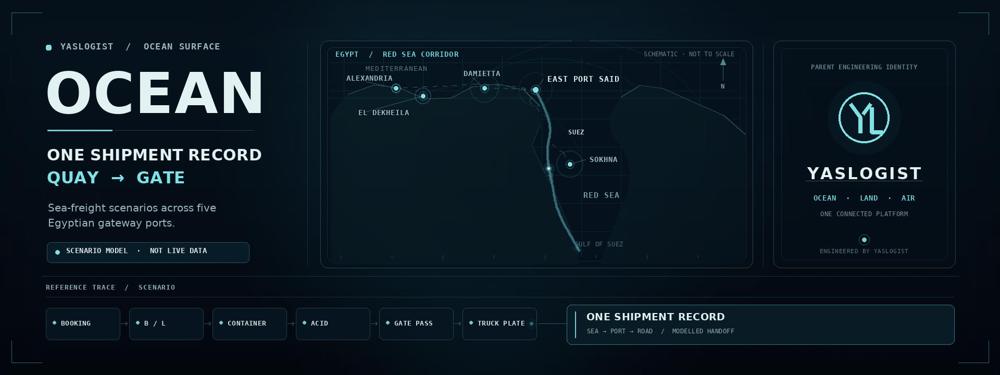
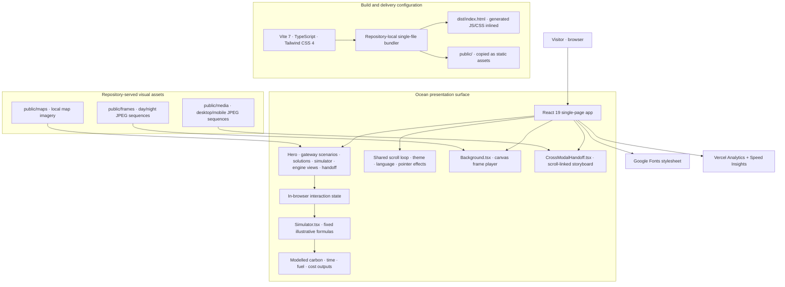

<div align="center">
  
  <p><sub>1920 × 720 · 9.6-second seamless loop · <a href="./assets/readme/yaslogist-hero.png">Open the static poster</a> · schematic scenario art, not live vessel data</sub></p>
</div>

# YASLOGIST Ocean

> **One shipment record. From quay to gate.**

**YASLOGIST Ocean** is a browser-based sea-freight capability demo. It frames five Egyptian gateway scenarios and demonstrates how shipment references and illustrative maritime signals could be read in one connected shipment context. This repository contains the Ocean presentation surface—not a live fleet, port-control, customs-filing, or freight-operation system.

<div align="center">

**PROJECT SURFACE** · Ocean scenario interface &nbsp;&nbsp;×&nbsp;&nbsp; **PARENT ENGINEERING IDENTITY** · YASLOGIST<br />
[Official YASLOGIST website](https://www.yaslogist.com) &nbsp;·&nbsp; [Ocean canonical URL](https://ocean.yaslogist.me/)

</div>

<div align="center">
  
</div>

## 01 / The system

The app is an interactive, single-page product showcase for YASLOGIST Ocean. Its current scenarios are centred on **Alexandria, El Dekheila, Sokhna, Damietta, and East Port Said**. The interface brings together five capability themes: repositioning signals, berth visibility, cold-chain monitoring, reference reconciliation, and a tamper-evident handoff concept.

**Operational boundary:** vessel positions, port states, ETA/forecast values, cold-chain traces, and simulator results are illustrative or simulated. The route artwork above is schematic and not to scale. The repository contains no application backend, live AIS feed, carrier integration, or direct customs connection. Customs references are described as customer- or broker-provided; YASLOGIST does not file declarations on their behalf.

## 02 / Capability surfaces

These are the behaviours represented by the demo UI—not claims of live operations or validated production engines.

- **01 · Repositioning / forecast** — models how demand, weather, port pressure, and fuel inputs can reveal an empty-container imbalance.
- **02 · Berth / vessel visibility** — presents berth-pressure scenarios across the five Egyptian gateways; vessel-style positions and states are not a live AIS feed.
- **03 · Cold chain** — uses a simulated temperature and humidity trace with a **2–8 °C demo band**.
- **04 · References / ACID** — illustrates cross-checking customer- or broker-filed references against the bill of lading. The UI labels seven reference types as modelled; the individual views show representative references such as booking, B/L, container, ACID, and gate pass.
- **05 · Trust / handoff record** — visualises four example stages—log, verify, reconcile, commit—for a tamper-evident shared record. This is not a deployed blockchain, ledger, or payment system.

The on-page scenario simulator recalculates carbon, time, fuel, and cost outputs from local controls using fixed illustrative coefficients. Its own interface labels the results as a demo model, not an operational benchmark, routing recommendation, or performance guarantee.

## 03 / Engineering architecture



The runtime diagram reflects the mounted app and files in this repository. There is **no application API, database, or live logistics integration layer** in the checked-in implementation. Google Fonts and the Vercel analytics packages are the external integrations visible in the app shell.

### Runtime stack

| Layer | Verified implementation |
|---|---|
| UI | React 19 · TypeScript 5.9 · Tailwind CSS 4 |
| Build | Vite 7 · `@vitejs/plugin-react` · `@tailwindcss/vite` |
| App composition | `src/App.tsx` · React theme and language providers · component-based sections |
| Local motion | Shared `requestAnimationFrame` scroll engine · canvas JPEG playback · SVG/interface animation |
| Localization | English, Arabic, Chinese, Turkish, French; Arabic uses RTL layout |
| External instrumentation | `@vercel/analytics` and `@vercel/speed-insights`, mounted in `src/main.tsx` |

## 04 / Execution flow

1. `index.html` applies the saved theme and language before the app paints, then loads the interface font stylesheet.
2. `src/main.tsx` mounts the React app; `ThemeProvider` and `LangProvider` hold the display preferences.
3. `src/App.tsx` assembles the Ocean sections and starts the shared scroll engine.
4. `src/components/Background.tsx` loads local day/night JPEG sequences and draws the active frames to a canvas as the visitor scrolls. The desktop sequence has 60 frames; the phone sequence has 30 frames per theme.
5. Simulator controls update local React state and recalculate fixed, illustrative outputs. No shipment request is sent to a YASLOGIST API.
6. `CrossModalHandoff.tsx` presents a scroll-linked sea-to-road storyboard from local JPEG sequences (48 desktop frames and 48 mobile frames).

## 05 / Ignition

```bash
git clone https://github.com/YASLOGIST/OCEAN-YASLOGIST.git
cd OCEAN-YASLOGIST
npm ci
npm run dev
```

Vite serves the local development app at `http://localhost:5173` by default. Useful project commands:

```bash
npm run typecheck       # TypeScript check (tsc --noEmit)
npm run test            # Deterministic scroll-engine harness
npm run build            # Production app build
npm run check:bundle     # Bundle guard; run after build
npm run gate             # typecheck → test → build → bundle guard
npm run preview          # Preview the production build locally
```

`vercel.json` declares `npm ci` as the install command and `npm run gate` as the build command, and includes response security headers. The configuration is present in the repository; this README does not claim a production deployment has been independently verified.

## 06 / Engineering status

| Area | Status in this repository |
|---|---|
| Responsive Ocean showcase | Implemented · React UI with five-language content and RTL support |
| Theme and interface preferences | Implemented · light/dark theme and language preference persisted locally |
| Scroll-driven visual system | Implemented · local frame sequences rendered through canvas/storyboard components |
| Scenario simulator | Implemented as a front-end model · fixed illustrative coefficients, not calibrated operations |
| Maritime, port, cold-chain, and reference signals | Demo-only · simulated or illustrative values |
| Live customer shipments or operational service | Not represented in this repository |
| Live AIS, carrier, customs, or port-system integrations | Not present in the checked-in app |
| Backend API, database, or user accounts | Not present in the checked-in app |
| Broader Saudi / Red Sea / Gulf coverage | Product direction in the interface copy; live integrations are not evidenced here |
| Package / license metadata | `package.json` is marked `private`; no `LICENSE` file is present in this repository |

## 07 / Source map

<details>
  <summary><strong>Open the implementation map</strong></summary>

| Path | Responsibility |
|---|---|
| `src/main.tsx` | React entry point · analytics and speed-insights components |
| `src/App.tsx` | Providers · page composition · shared scroll and interaction setup |
| `src/components/` | Hero, gateway stats, solutions, simulator, five engine views, handoff, closing, footer |
| `src/lib/scroll.ts` | Shared scroll state, interpolation, reduced-motion handling, lifecycle |
| `src/lib/i18n.tsx` | Five-language dictionary and RTL direction |
| `src/lib/theme.tsx` | Persisted light/dark theme |
| `src/index.css` | Tailwind v4 import · theme tokens · component and motion styles |
| `public/frames/` | Day/night background JPEG sequences for landscape and phone layouts |
| `public/media/` | Sea-to-road handoff JPEG sequences and supporting media |
| `public/maps/` | Local map imagery |
| `vite.config.ts` | Vite setup and repository-local single-file build plugin |
| `tests/scroll-harness.ts` | Deterministic tests for the shared scroll engine |
| `scripts/check-bundle.mjs` | Built-artifact content and single-file bundle guard |
| `vercel.json` | Repository-level Vercel build command and response headers |

</details>

## 08 / README visual system

The hero and supporting motion are generated specifically for this repository and stored locally. The hero’s route, gateway labels, single-record reference trace, and YL mark derive from the project’s Ocean scenarios and current in-repo YASLOGIST mark geometry. No external image host is used.

| Asset | Role · verified properties |
|---|---|
| [`yaslogist-hero.gif`](./assets/readme/yaslogist-hero.gif) | First-screen animated hero · 1920 × 720 · 120 frames · 9.6 s loop · 12.5 fps · 9.60 MB |
| [`yaslogist-hero.png`](./assets/readme/yaslogist-hero.png) | Static poster / fallback · 1920 × 720 PNG · matching composition |
| [`yaslogist-signal-divider.gif`](./assets/readme/yaslogist-signal-divider.gif) | Kinetic section divider · 1280 × 32 · 80 frames · 6.4 s loop |
| [`yaslogist-signature.gif`](./assets/readme/yaslogist-signature.gif) | Closing brand animation · 720 × 160 · 60-frame loop |
| [`render_assets.py`](./assets/readme/render_assets.py) | Local asset source · regenerates the poster and all three animations; uses Pillow and system DejaVu fonts |

<details>
  <summary><strong>Asset notes and regeneration</strong></summary>

- Run `python assets/readme/render_assets.py` from the repository root to regenerate the assets. The renderer requires Pillow and DejaVu Sans fonts; these are asset-authoring tools, not app dependencies.
- The hero GIF was decoded and checked locally for dimensions, frame count, duration, loop metadata, and the beginning-to-end frame boundary. Representative frames and the poster were inspected.
- The pre-existing `yaslogist-hero.svg` is retained unchanged but is not referenced as the README hero. The pre-rendered GIF is used for predictable static-image rendering in the GitHub README.
- GitHub’s rendered page was not available for a browser screenshot in this environment; asset checks are local file and frame inspections.

</details>

## 09 / YASLOGIST

**YASLOGIST** is the permanent parent engineering and creative identity. **Ocean** is this repository’s product surface: a maritime capability demo designed around one shipment record and a visible sea-to-road handoff.

Built by **Ahmed Yasser Ali**, platform founder and Supply Chain & Logistics Specialist. No open-source licence is included in this repository; request permission before reusing YASLOGIST brand assets.

<div align="center">
  
  <p><strong>YASLOGIST</strong> · Parent engineering signature for YASLOGIST Ocean · <a href="https://www.yaslogist.com">www.yaslogist.com</a></p>
</div>
